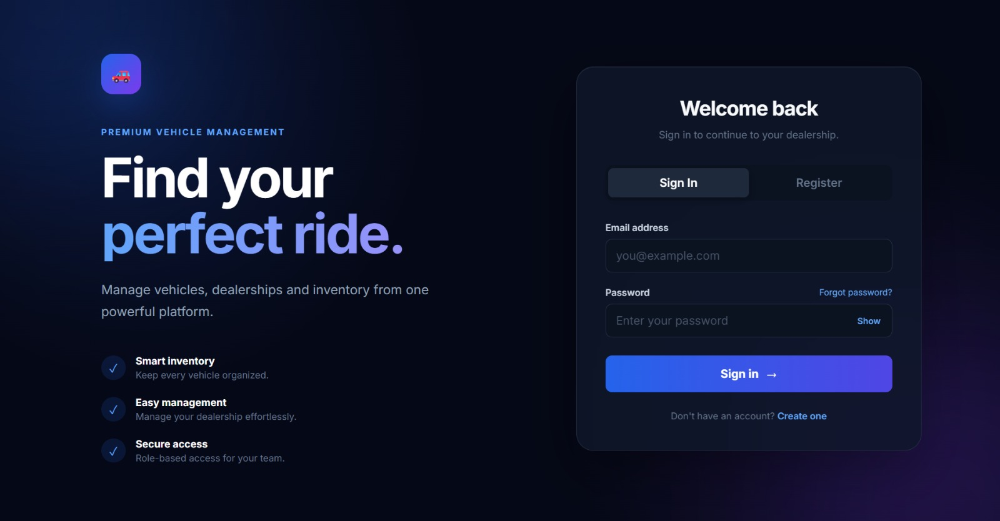
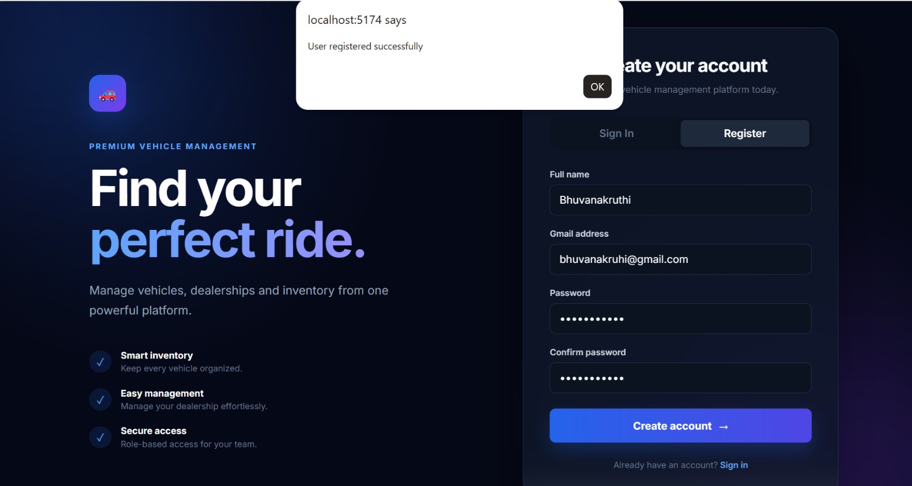
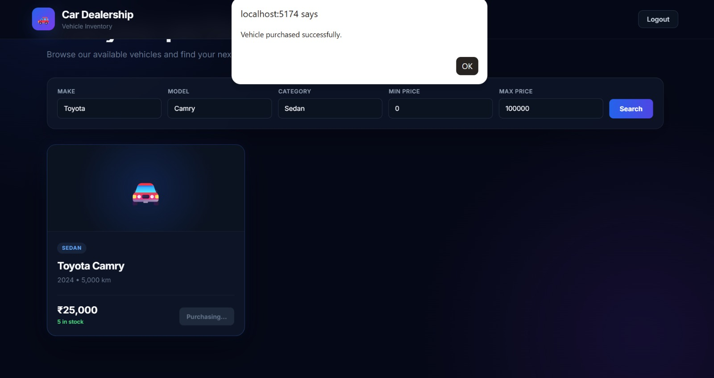
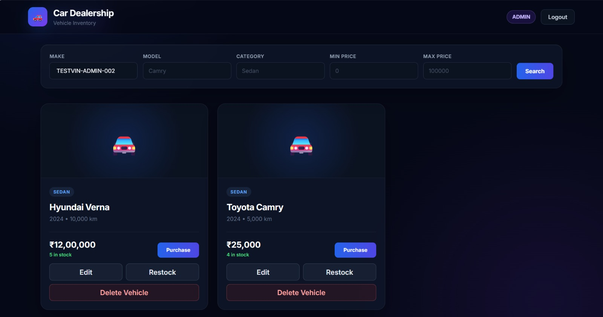

# Car Dealership Inventory System

A full-stack Car Dealership Inventory System built as a TDD kata using React, TypeScript, Node.js, Express, PostgreSQL, and Prisma.

The application provides a web-based platform for managing dealership vehicles and inventory, with JWT authentication and role-based authorization for secure administrative operations.

---

## Project Overview

The Car Dealership Inventory System allows customers and administrators to interact with dealership inventory through a modern web application.

### User Capabilities

- Register and log in
- Browse available vehicles
- Search and filter vehicles
- Purchase available vehicles
- View updated vehicle quantities after purchase

### Administrator Capabilities

- Add vehicles
- Update vehicle details
- Delete vehicles
- Restock vehicle quantities
- Manage dealerships
- Manage dealership inventory

The backend uses JWT-based authentication and role-based authorization to protect administrative operations.

---

## Technology Stack

### Frontend

- React
- TypeScript
- HTML5
- CSS3
- Tailwind CSS
- Vite

### Backend

- Node.js
- TypeScript
- Express.js
- JWT authentication
- bcryptjs

### Database

- PostgreSQL
- Prisma ORM

### Testing

- Jest
- Supertest

### Version Control

- Git
- GitHub

---

## Main Features

### Authentication

- User registration
- User login
- JWT token authentication
- Password hashing with bcrypt
- USER and ADMIN roles

### Vehicle Management

- List available vehicles
- Search by make
- Search by model
- Search by category
- Filter by price range
- Add vehicles
- Update vehicle details
- Delete vehicles
- Purchase vehicles
- Restock vehicles

### Authorization

Administrative operations are protected using JWT authentication and role-based authorization.

Normal users can access customer functionality but cannot perform admin-only operations.

Admin-only operations return `403 Forbidden` when attempted by a normal user.

---

## Project Structure

```text
car-dealership/
├── backend/
│   ├── src/
│   │   ├── config/
│   │   ├── controllers/
│   │   ├── middleware/
│   │   ├── routes/
│   │   ├── services/
│   │   ├── app.ts
│   │   └── server.ts
│   ├── prisma/
│   │   └── schema.prisma
│   ├── tests/
│   │   ├── auth/
│   │   ├── dealerships/
│   │   ├── inventory/
│   │   └── vehicles/
│   └── package.json
│
├── frontend/
│   ├── src/
│   └── package.json
│
├── screenshots/
│   ├── login.jpeg
│   ├── Registration.jpeg
│   ├── Purchase.jpeg
│   └── admin-dashboard.jpeg
│
├── PROMPTS.md
├── .gitignore
└── README.md
```

---

## API Endpoints

### Authentication

| Method | Endpoint | Description |
|---|---|---|
| POST | `/api/auth/register` | Register a new user |
| POST | `/api/auth/login` | Log in and receive a JWT |

### Vehicles

| Method | Endpoint | Access |
|---|---|---|
| GET | `/api/vehicles` | Public |
| GET | `/api/vehicles/search` | Public |
| POST | `/api/vehicles` | ADMIN |
| PUT | `/api/vehicles/:id` | ADMIN |
| DELETE | `/api/vehicles/:id` | ADMIN |
| POST | `/api/vehicles/:id/purchase` | Authenticated |
| POST | `/api/vehicles/:id/restock` | ADMIN |

### Dealerships and Inventory

The backend also provides dealership and inventory management APIs protected according to user roles.

These APIs support:

- Listing dealerships
- Viewing individual dealerships
- Creating dealerships
- Updating dealerships
- Deleting dealerships
- Viewing dealership inventory
- Adding inventory
- Updating inventory
- Deleting inventory
- Role-based authorization

---

## Local Setup

### Prerequisites

Install the following:

- Node.js
- npm
- PostgreSQL

### Backend Setup

Open a terminal and run:

```bash
cd backend
npm install
```

Create a `.env` file in the `backend` directory containing the required database and JWT configuration.

Example:

```env
DATABASE_URL="your-database-url"
DIRECT_DATABASE_URL="your-direct-postgresql-url"
JWT_SECRET="your-jwt-secret"
```

Do not commit real database credentials, API keys, or secrets to Git.

Run the required Prisma setup and migrations according to the project configuration.

Start the backend:

```bash
npm run dev
```

The backend runs on:

```text
http://localhost:3000
```

### Frontend Setup

Open another terminal:

```bash
cd frontend
npm install
npm run dev
```

The frontend is served using Vite.

The frontend communicates with the backend through:

```text
http://localhost:3000/api
```

---

## Authentication

Users can register and log in through the frontend.

After successful authentication, a JWT token is used for protected API requests.

---

## Admin Account

For local testing, an administrator account can be created using the project's local admin creation script.

Example development credentials:

```text
Email: admin@gmail.com
Password: Password123!
```

> **Note:** Do not use development credentials in a production deployment.

---

## Running Tests

From the backend directory:

```bash
npm test -- --runInBand
```

---

## Test Results

The complete backend test suite passes successfully:

```text
Test Suites: 5 passed, 5 total
Tests:       52 passed, 52 total
Snapshots:   0 total
```

The test suite covers:

- User registration
- User login
- Authentication
- Vehicle APIs
- Dealership APIs
- Inventory APIs
- Role-based authorization
- Input validation
- Error handling
- Vehicle purchasing
- Inventory operations

---

## Production Build

To create a production build of the frontend:

```bash
cd frontend
npm run build
```

The frontend production build completes successfully using TypeScript and Vite.

---

## Security

The application includes several security measures:

- Passwords are hashed using bcrypt.
- JWT tokens are used for authenticated requests.
- Administrative routes require the `ADMIN` role.
- Normal users cannot perform admin-only vehicle or inventory operations.
- Database credentials and secrets are stored using environment variables.
- `.env` files should not be committed to the repository.

---

## Screenshots

### Login

The authentication interface allows users to securely sign in to the application.



### User Registration

Users can create an account using the registration form.



### Vehicle Search and Purchase

Users can search for vehicles and purchase available vehicles. The inventory quantity is updated after a successful purchase.



### Admin Vehicle Management

Administrators have additional controls for managing the vehicle inventory, including adding, editing, restocking, and deleting vehicles.



---

## TDD and Development Process

The project was developed using a Test-Driven Development approach with automated backend testing using Jest and Supertest.

The development process included:

1. Defining functionality and expected behavior
2. Writing and running tests
3. Implementing the required functionality
4. Identifying and debugging failing tests
5. Refactoring and improving the implementation
6. Re-running the complete test suite

The final backend test suite contains **52 passing tests** covering authentication, vehicle management, dealership management, inventory management, validation, and authorization.

### Final Test Result

```text
5 test suites passed
52 tests passed
0 tests failed
```

---

## My AI Usage

### Tool Used

**ChatGPT**

### How I Used It

I used ChatGPT as a development assistant during this project for:

- Brainstorming implementation approaches
- Generating and improving boilerplate code
- Debugging TypeScript and Express issues
- Reviewing API routes and middleware
- Troubleshooting Prisma and PostgreSQL configuration
- Diagnosing failing automated tests
- Improving frontend/backend integration
- Assisting with test cases
- Reviewing errors encountered during development
- Preparing project documentation

AI-generated suggestions were reviewed, adapted, and tested against the actual application before being incorporated into the project.

### Reflection

ChatGPT helped speed up development and debugging, particularly when working through authentication, database configuration, API integration, and automated test failures.

I used it as a development aid while manually verifying the implementation through automated tests and by testing the application functionality locally.

AI assistance was especially useful during debugging because it helped identify configuration and authentication issues quickly and provided possible approaches for resolving them.

The final implementation was tested locally, including the complete backend test suite and manual frontend functionality.

---

## AI Prompt Documentation

The raw AI interactions used during development are documented separately in:

```text
PROMPTS.md
```

The prompt documentation is maintained separately from this README as required by the project instructions.

---

## Git and Version Control

Git was used throughout development to track implementation changes.

Commits were created for major development stages, including:

- Initial project setup
- Backend API implementation
- Authentication
- Frontend React migration
- Tailwind CSS configuration
- Vehicle search
- Vehicle inventory functionality
- Frontend integration
- Testing and debugging
- Documentation

AI-assisted development was documented as part of the project's AI usage requirements.

---

## Manual Verification

The following application functionality was manually verified:

- User registration
- User login
- Admin login
- Vehicle listing
- Vehicle search
- Vehicle purchase
- Vehicle quantity reduction after purchase
- Admin vehicle creation
- Admin vehicle editing
- Admin vehicle deletion
- Admin vehicle restocking
- Normal USER access
- Blocking normal USER access to admin-only operations

Normal users can access vehicle browsing, searching, and purchasing functionality while administrative operations remain restricted to users with the `ADMIN` role.

---

## Conclusion

The Car Dealership Inventory System provides a complete full-stack implementation for vehicle and inventory management.

The project combines:

- RESTful TypeScript/Express backend
- PostgreSQL database persistence
- Prisma ORM
- JWT authentication
- Role-based authorization
- React frontend
- Tailwind CSS
- Automated Jest and Supertest testing
- Git-based development
- Transparent AI-assisted development documentation

The final backend test suite passes all **52 tests successfully**.

```text
5 test suites passed
52 tests passed
0 tests failed
```
